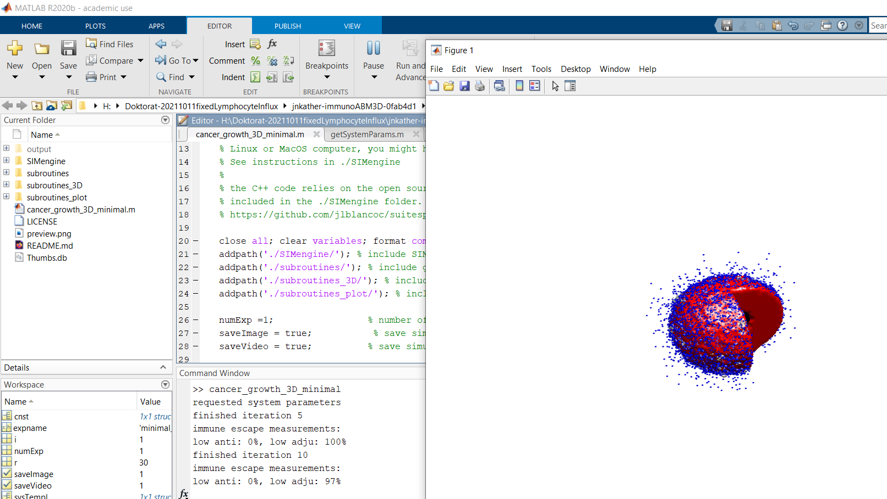

# acidicTumorABM3D
3D agent-based model of avascular tumor growth in the acidic tumor microenvironment
## About

This is a 3D on-lattice agent-based model of tumor growth in the tumor microenvironment (TME). It includes tumor cells, lymphocytes, stroma and necrosis, as well as substances present in the TME: oxygen, glucose and protons.
The model takes into account tumor cell metabolism and the resulting acidification of the TME. Additionally, it allows for the modelling of anti-PD-1 therapy as well as CAIX inhibition.

The model and its application to study the enzyme CAIX as a driver of immunotherapy resistance and potential combination therapy target has been presented in the following publication:

Grajek Julia, Kather Jakob Nikolas and Poleszczuk Jan 2023; An in silico model to study the impact of carbonic anhydrase IX expression on tumour growth and anti-PD-1 therapyJ. R. Soc. Interface.202022065420220654, http://doi.org/10.1098/rsif.2022.0654.

It is an extension and modification of a model presented in a different github repository:
https://github.com/jnkather/immunoABM3D/tree/v0.1,
which had been described in a previous publication:

Jakob Nikolas Kather, Pornpimol Charoentong, Meggy Suarez-Carmona, Esther Herpel, Fee Klupp, Alexis Ulrich, Martin Schneider, Inka Zoernig, Tom Luedde, Dirk Jaeger, Jan Poleszczuk, Niels Halama;
High-Throughput Screening of Combinatorial Immunotherapies with Patient-Specific In Silico Models of Metastatic Colorectal Cancer.
Cancer Res 1 September 2018; 78 (17): 5155–5163. https://doi.org/10.1158/0008-5472.CAN-18-112644444

Please cite these papers if you re-use the code. 

## How to run / compile

The model engine is implemented in C++. Via MEX, this can be used by the high-level Matlab functions. We provide a compiled version that can be used on a Windows machine (Windows 10). If you use another operating system, you can compile the code with the scripts provided in ./SIMengine. This requires SuiteSparse which is available at https://github.com/jlblancoc/suitesparse-metis-for-windows/
Furthermore, compilation of the code requires Eigen which is available here: http://eigen.tuxfamily.org/

To start the tumor growth simulation, run the file cancer_growth_3D_minimal.m. In the current state, this will start a simulation of the growth of a spherical CAIX expressing tumor with a radius of 30 cells, placed in the center of the domain:

If you wish to start the simulation from one tumor cell placed in the center of the domain or to add pharmacokinetics to the simulation, you may change the parameter expetiment_id in the cancer_growth_3D_minimal.m file. 

## Licenses

The License for the source codes is available in the LICENSE file. The license for the external DLLs in ./SIMengine is available on Github at https://github.com/jlblancoc/suitesparse-metis-for-windows/

## Contact

Please feel free to contact Julia Grajek or Jan Poleszczuk if you have any questions.
